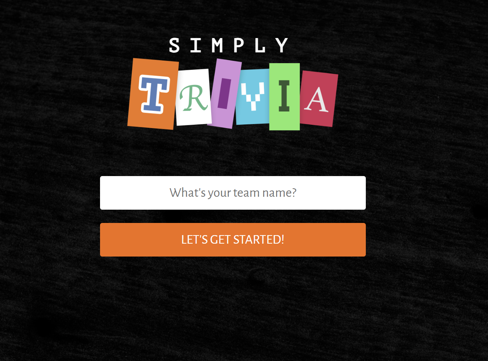

# Simply Trivia

Fun little trivia game with the intent of showcasing React and Express interacting as a Front-end and Back-end application.



## Installation

We use DotEnv to manage environment variables, make sure to create the `.env` file:

```bash
cp .env.example .env
```

Then proceed to install dependencies and run the project like so:
```bash
npm install
npm start
```

## Contributing

Pull requests are welcome. For major changes, please open an issue first to discuss what you would like to change.

Please make sure to introduce/describe tests as appropriate.

## License

[MIT](https://choosealicense.com/licenses/mit/)
